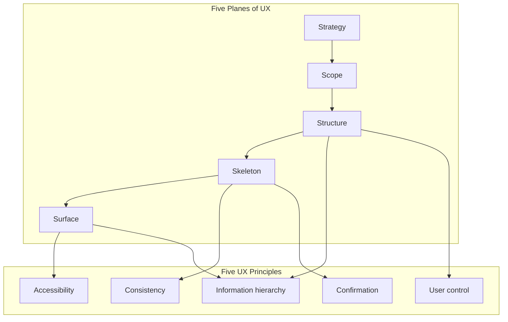

# Paperbag Hobbies

A responsive front-end website for Paperbag Hobbies, an independent online shop selling proxy miniatures from third-party creators for tabletop wargaming and role-playing games.

Built for the Gateway Qualifications Level 5 Diploma in Web Application Development, Unit 1: User Centric Front End Development (Y/650/3525).

> **Status:** Work in progress. Sections marked `TODO` are completed as each build phase finishes.

---

## Contents

1. [Purpose](#1-purpose)
2. [Target Audience and User Stories](#2-target-audience-and-user-stories)
3. [UX Design and Rationale](#3-ux-design-and-rationale)
4. [Design System](#4-design-system)
5. [Technology Stack](#5-technology-stack)
6. [Development Decisions](#6-development-decisions)
7. [Testing](#7-testing)
8. [Version Control](#8-version-control)
9. [Deployment](#9-deployment)
10. [Attribution](#10-attribution)

---

## 1. Purpose

Paperbag Hobbies is a real, independently run online shop that sells proxy miniatures made by a range of third-party creators, for tabletop wargaming and role-playing games. The range covers two settings: the grimdark far future and medieval fantasy. This website is the shop front for the business, and the owner is the client for this project.

### 1.1 The problem

Proxy models come from many independent creators, so hobbyists often have to search several places to find what they need. One storefront that gathers a range of models and groups them by setting makes them quicker to find and to buy.

### 1.2 Client requirements

The owner supplied the colour palette, the visual style and the requirements below during planning.

| Requirement | Source | How the site addresses it |
|---|---|---|
| Eye-catching, brand-led visual style | Owner brief | Owner's palette and mascot artwork, contrast-checked (section 4.3) |
| Easy to navigate | Owner brief | Persistent single-row site header (.header-container with .primary-nav and .header-actions), announcement bar, mobile hamburger toggle with ARIA disclosure, and a skip link. |
| Helps customers find and buy models | Owner brief | Browsing by setting and category, clear prices and a clear purchase action |
| Featured promotional models in a homepage hero slideshow | Owner brief | Hero slideshow with user-controlled navigation |
| Lightbox for viewing images | Owner brief | Accessible lightbox for enlarged product images |
| Responsive across devices | Owner brief | Mobile-first layout tested from 320px to 1440px |
| PayPal payments | Owner brief | Planned for a later project, so out of scope here (section 1.5) |

### 1.3 Target audience

The age ranges are working estimates based on general tabletop hobby demographics, not measured data. They will be checked against the owner's customer insights.

| Audience | Est. age | Needs | Design response |
|---|---|---|---|
| Core wargamers (primary) | 25 to 44 | Find models for their armies quickly, with clear prices and scale information | Filtering by setting, detailed product information |
| Role-playing game players | 18 to 40 | Find single character and monster models | Strong product images, easy browsing |
| Newer and younger hobbyists | 16 to 24 | A fast, phone-friendly experience | Mobile-first layout, 44px touch targets |
| Returning and older hobbyists | 45 to 60+ | Readable, simple pages | High contrast, resizable text, plain navigation |
| Gift buyers (secondary) | 30 to 60 | Understand the range without jargon | Plain category names, an obvious route to buy |

### 1.4 Value the site provides

- A visitor can tell what the shop sells within seconds of arriving.
- Current promotions are visible on the homepage.
- Models can be browsed by setting, and product images can be enlarged to check detail before buying.
- The site works on phones, tablets and desktops, and can be used by keyboard and screen reader.

### 1.5 Scope

This project delivers the front end: HTML, CSS and light JavaScript for the navigation, slideshow and lightbox. PayPal payment, accounts and order handling need a back end and are planned for later projects. No data is sent anywhere at this stage, and the site says so wherever a form or checkout appears. Delivery, returns, privacy and contact pages are planned for a later sprint (see the product backlog in section 2.2), and links to them are added only once the pages exist.

### 1.6 Development approach

The site is built as separate, semantic HTML pages first, validated page by page. CSS is written mobile-first with design tokens. JavaScript is added only for interactive features. I looked at a dynamic `<template>` approach early on, but chose separate semantic HTML pages as the foundation (see section 6.3). Each step is tested before the next begins, and each feature is committed separately.

---

## 2. Target Audience and User Stories

| ID | User story | Acceptance criteria |
|---|---|---|
| US01 | As a first-time visitor, I want to see straight away what the site sells, so I can decide if it is for me. | The headline and one supporting sentence state the offer. A link to the shop is visible without scrolling at 375px and 1280px. |
| US02 | As a returning customer, I want to see current promotions on the homepage, so I can spot deals. | A hero slideshow shows featured models. Previous and next controls work by mouse, touch and keyboard. Nothing moves unless the user acts. |
| US03 | As a wargamer, I want to browse by setting and category, so I can find models for my army. | Models are grouped by grimdark future and fantasy medieval. A filter shows only matching products. |
| US04 | As a shopper, I want to enlarge product images, so I can check the detail before buying. | A lightbox opens from a product image. `Escape` closes it, focus stays inside while open, and focus returns to the image on close. |
| US05 | As a shopper, I want a clear purchase action on each product, so I know how to buy it. | Each product shows its price and a clear buy button. Until PayPal is added, the button explains that online checkout is coming soon. |
| US06 | As a mobile user, I want a layout that fits my screen, so I can browse comfortably. | No horizontal scrolling from 320px to 1440px. Links and buttons are at least 44px tall. |
| US07 | As a keyboard or screen reader user, I want to navigate every page independently, so I can use the site without a mouse. | A skip link is the first focusable item. Focus is always visible. Images have meaningful alt text. Text meets WCAG AA contrast. |

Each story's acceptance criteria become tests in [TESTING.md](TESTING.md), and each test names its story ID.

### 2.1 Agile approach

The project follows a lightweight Scrum-style process, adapted for a single developer.

| Scrum element | How it is applied |
|---|---|
| Product backlog | User stories in section 2.2, ordered by MoSCoW priority. New stories are added as they emerge. |
| Sprint | Each roadmap phase is one sprint with its own goal. |
| Sprint backlog | The numbered steps inside the phase, each tested and committed separately. |
| Sprint review | At the end of each sprint, the result is checked against the acceptance criteria and recorded in [TESTING.md](TESTING.md). |
| Retrospective | Short notes at the end of each sprint on what worked and what to change. |

**Definition of done** for every step:

- The code is saved and committed with a Conventional Commit message.
- The browser console shows no errors.
- HTML and CSS pass the W3C validators (known exception: bug B2).
- Manual tests for the step are written, run and evidenced.
- Keyboard and responsive checks are done at 375px, 768px and 1280px.
- README and TESTING.md are updated at the end of the step.

**Sprint 1 retrospective (Phase 1, foundations)**

- *Worked:* testing before committing caught a WCAG contrast failure in the original palette (B1) before any component used it. Researching three similar shops before building gave evidence for each design decision (section 3). Using native `<dialog>` for the US04 lightbox delivered built-in keyboard accessibility and focus restoration without extra library overhead.
- *Changed:* screenshots and documentation are now committed once per step instead of one at a time, and git commands are run singly so a failed command is seen.

### 2.2 Product backlog

| ID | Story | Priority | Sprint | Status |
|---|---|---|---|---|
| US01 | First-time visitor sees what the shop sells | Must | TBC | Backlog |
| US02 | Homepage hero slideshow of promotions | Must | TBC | Backlog |
| US03 | Browse by setting and category | Must | TBC | Backlog |
| US04 | Enlarge images in a lightbox | Must | Sprint 1 | Complete |
| US05 | Clear purchase action on each product | Should | TBC | Backlog |
| US06 | Responsive layout on all devices | Must | Every sprint | In progress |
| US07 | Keyboard and screen reader access | Must | Every sprint | In progress |
| US08 | As a customer, I want to find delivery, returns, privacy and contact information, so I can get help and understand how my data is used. | Should | Next release | Backlog |
| US09 | As a customer, I want to pay securely with PayPal, so I can complete my purchase. | Won't (this release) | Later project | Backlog |
| US10 | As a shopper, I want to search by name or keyword, so I can find a specific model quickly. | Could | Next release | Backlog |
| US11 | As a shopper, I want to see which creator made each model, so I can follow and credit them. | Should | TBC | Backlog |
| US12 | As the shop owner, I want to test the site with real gamers, so I can fix usability problems. | Should | After Sprint 3 | Backlog |

Further user stories are added after each sprint review and after user testing, with the date added.

---

## 3. UX Design and Rationale

This project follows Jesse James Garrett’s **Five Planes of User Experience** methodology, moving from abstract goals down to the concrete interface the visitor sees. Each plane answers a different set of questions.

#### Strategy (what is worth doing, what we are creating, and the value it provides)

**Focus – what is worth doing?**  
Paperbag Hobbies currently has no dedicated online storefront. Proxy models are scattered across many independent creators, so hobbyists have to hunt in several places. Building a single, brand-led shop front that gathers models by setting is worth doing because it solves that fragmentation for the owner and for the customer.

**Definition – what are we creating?**  
A responsive front-end website (HTML, CSS and light JavaScript) that acts as the public face of the shop. It is not a full e-commerce platform yet — PayPal, accounts and order handling are deferred to later projects — but it must clearly show what the shop sells, let visitors browse by setting, enlarge product images, and understand how to buy.

**Value**  
- *For the owner:* a professional online presence that consolidates the range, reduces the need for customers to search elsewhere, and can later accept payments.  
- *For visitors:* they can tell what the shop sells within seconds, find models for their army or character by setting, check fine detail in a lightbox, and see honest pricing and purchase information. Different audience groups (core wargamers, RPG players, newer hobbyists, gift buyers) each get a clear path to the models that matter to them.

#### Scope (features and content)

At Scope level the strategy is turned into concrete requirements.

**Functional features (Phase 1 MVP)**  
- Responsive layout that works from 320 px to 1440 px  
- User-controlled hero slideshow of featured models (no autoplay)  
- Product browsing with setting/category filters  
- Accessible lightbox for enlarged product images  
- Clear purchase action on each product (honest “online checkout coming soon” until PayPal is added)  
- Skip link, visible focus and keyboard operability  

**Content requirements**  
- Plain-language headline and supporting sentence that state what the shop sells  
- Product cards with image, title, price and short description  
- Setting labels (Grimdark Future / Medieval Fantasy)  
- Non-affiliation notice and basic trust information in the footer  
- Alt text on all content images  

Each item is justified by the owner brief, a user story, or a finding from the competitor review. Phase 2 (PayPal, accounts, live inventory) is deliberately out of scope for this unit.

#### Structure (interaction design and information architecture)

Structure decides the relationships between pieces of information and the order in which a visitor should encounter them.

**Priority order for a first-time visitor (homepage)**  
1. What the shop sells (headline + one supporting sentence + primary “Browse Shop” action)  
2. Current promotions (user-controlled hero slideshow)  
3. A sample of models the visitor can explore immediately (featured product cards)  
4. Persistent way to reach Shop, About and (later) support pages (header navigation)  
5. Trust and legal information (footer)  

**Information relationships**  
- Personal/brand identity (logo + shop name) sits with the main navigation so the visitor always knows where they are.  
- Product image, title, price and action are kept together on every card so the decision to look closer or buy is never separated from the item.  
- Setting filters live with the product list on the Shop page, not in a separate menu, so filtering feels part of browsing rather than a detour.  

Navigation order mirrors the same priority: Home → Shop → About, with Cart available but not competing with the primary tasks.

#### Skeleton (interface design, navigation design and layout patterns)

Skeleton turns the structure into concrete layout and interaction patterns.

- **Mobile-first single column** that expands into a multi-column CSS Grid for product cards on wider screens.  
- **Repeated layout patterns** for consistency: the same sticky header, the same footer structure, and the same card anatomy (image → title → price → action) appear on every page. Once a visitor has seen the pattern on the homepage they can predict it on the Shop page.  
- **44 × 44 px minimum touch targets** and visible text labels on every control.  
- **Low-fidelity wireframes** (section 3.1) tested the arrangement of these elements before any CSS was written.  

The repeated header/footer and card pattern is intentional — it reduces the amount a visitor has to re-learn when they move between pages.

#### Surface (visual design)

Surface is the most concrete plane — colour, type, imagery and the final visual hierarchy the visitor actually sees.

- Custom CSS design tokens keep colour, spacing and radii consistent.  
- Inter (400/600/700) with a system-font fallback.  
- Strict WCAG 2.1 AA contrast (the original palette failed and was corrected — see section 4.3 and bug B1).  
- Hero text sits on a solid or overlay panel so contrast is guaranteed even when a photographic background is used.  
- Product imagery is local, compressed, and given explicit width/height to avoid layout shift.  

Surface decisions reinforce the meaning established on the planes above rather than introducing new information.

### 3.0 Five UX principles

The unit specification requires explicit coverage of five core UX principles. Each principle is mapped below to concrete decisions already made in this project.

| Principle | How it is applied in Paperbag Hobbies | Evidence |
|---|---|---|
| **Information hierarchy** | One clear `<h1>` states the offer; supporting content uses `<h2>` / `<h3>`. The hero and primary call-to-action appear above the fold on both mobile and desktop. Product cards lead with image → title → price → action. | D1, D9, wireframes 3.1 & 3.2 |
| **User control** | No autoplay media. The hero slideshow moves only when the user presses previous/next. The lightbox opens and closes only on explicit user action (click, keyboard or Escape). Nothing is forced on the visitor. | D4, US02, US04, WCAG 2.2.2 |
| **Consistency** | Shared header, footer and landmark structure on every page. Design tokens control colour, spacing and type. All interactive controls meet the same 44 × 44 px minimum and carry visible text names. | A3, A7, A8, D12, D13 |
| **Confirmation** | Every meaningful action will give visible feedback (button state change, lightbox open/close, filter result count, form success/error message). Until those features are built, the principle is recorded as a design requirement. | US05, planned form and filter feedback |
| **Accessibility** | Skip link is the first focusable element. Colour contrast meets WCAG 2.1 AA (bug B1 fixed before any components used the palette). Focus is visible and managed in the lightbox. Images will carry meaningful `alt` text. Touch targets are ≥ 44 px. | D7, D13, D15, D18, section 4.3, US07 |

These five principles sit inside the broader Five Planes framework already described above: Strategy and Scope define *what* must be achieved; Structure, Skeleton and Surface are the means by which the principles are delivered.


**Figure 1 – Relationship between the Five Planes and the five UX principles.**  
Strategy and Scope define the project goals. The three lower planes (Structure, Skeleton, Surface) are the layers in which the five UX principles are actually delivered. Information hierarchy and user control are shaped mainly at Structure level; consistency and confirmation at Skeleton level; accessibility is realised most visibly at Surface level, while still being constrained by decisions made higher up.

### 3.1 Wireframes

#### Desktop wireframe (1024 px+)

```text
+-------------------------------------------------------------------------------------+
| [Skip to content]                                                                   |  ← visually hidden until focused
+-------------------------------------------------------------------------------------+
| Announcement Bar: Free shipping & store notices                                     |
+-------------------------------------------------------------------------------------+
| [Logo] Paperbag Hobbies        Home   Shop   About Us                  [Cart 0]     |  ← single-row inline header (sticky)
+-------------------------------------------------------------------------------------+
|                                                                                     |
|  +-------------------------------------------------------------------------------+  |
|  |  HERO (solid panel over image or plain background)                            |  |
|  |  Headline: clear statement of what the shop sells                             |  |
|  |  One supporting sentence                                                      |  |
|  |  [ Browse Shop ]                                                              |  |
|  |  ◀  ●  ●  ●  ▶   (user-controlled slideshow controls only)                   |  |
|  +-------------------------------------------------------------------------------+  |
|                                                                                     |
|  Featured models                                                                 |  |
|  +-------------+  +-------------+  +-------------+  +-------------+              |  |
|  |   Image     |  |   Image     |  |   Image     |  |   Image     |              |  |
|  |   Title     |  |   Title     |  |   Title     |  |   Title     |              |  |
|  |   Price     |  |   Price     |  |   Price     |  |   Price     |              |  |
|  | [View]      |  | [View]      |  | [View]      |  | [View]      |              |  |
|  +-------------+  +-------------+  +-------------+  +-------------+              |  |
|                                                                                     |
+-------------------------------------------------------------------------------------+
|  Footer: Shipping · Contact · Non-affiliation notice · © Paperbag Hobbies           |
+-------------------------------------------------------------------------------------+
```

##### Rationale (desktop)

- Sticky site header keeps navigation and cart always available while scrolling (supports US03, US05).
- Single-Row Layout: Header elements (.header-brand-row, .primary-nav, and .header-actions) sit inline in a horizontal Flexbox container (.header-container) for clean alignment and scaling.
- Announcement bar provides high-contrast store notices at the very top.
- Hero sits on a solid or overlay panel so text contrast is guaranteed (D15).
- Slideshow is strictly user-controlled (no autoplay) to satisfy WCAG 2.2.2 and US02.
- Product cards are image-led with real text labels (D3, D5).
- Single <h1> in the hero; everything else is <h2> / <h3>.

#### Mobile wireframe (320 px – 768 px)

```text
+---------------------------------------------------------------+
| [Skip to content]                                             | ← visually hidden until focused
+---------------------------------------------------------------+
| Announcement Bar                                              |
+---------------------------------------------------------------+
| [Logo] Paperbag Hobbies       [≡ Menu] (44×44px)   [Cart 0]   |  ← header container (single row)
+---------------------------------------------------------------+
| PRIMARY NAVIGATION (.primary-nav.is-open)                     |
|  • Home                                                       |
|  • Shop                                                       |
|  • About Us                                                   |
+---------------------------------------------------------------+
|                                                               |
|  HERO                                                         |
|  Headline                                                     |
|  Supporting sentence                                          |
|  [ Browse Shop ]                                              |
|  ◀ ● ● ● ▶                                                   |
|                                                               |
|  Featured models                                              |
|  +---------------------------------------------------------+  |
|  | Image                                                   |  |
|  | Title                                                   |  |
|  | Price                                                   |  |
|  | [View]                                                  |  |
|  +---------------------------------------------------------+  |
|  (one card per row)                                           |
|                                                               |
+---------------------------------------------------------------+
|  Footer (stacked links)                                       |
+---------------------------------------------------------------+
```

##### Rationale (mobile)

- Single-row mobile header header container (`.header-container`) aligns logo, hamburger menu button, and cart action inline to optimize vertical screen real estate.
- Mobile menu toggle (`.nav-toggle`) and cart icon meet the minimum 44 × 44 px touch target rule (D13).
- Primary navigation uses `.primary-nav` with class `.is-open` dynamically toggled via JavaScript to slide/drop down without pushing main content off-screen.
- Navigation link text matches the actual site pages (**Home**, **Shop**, **About Us**).
- Hero and product cards stack vertically into a single column with full-width target areas to avoid horizontal scrolling down to 320px viewports (US06).
- Skip link remains the first focusable element in DOM order on all viewports (D7).

#### Accessible lightbox / product detail wireframe

```text
+---------------------------------------------------------------------+
|  BACKDROP (semi-transparent, click closes)                          |
|                                                                     |
|     +----------------------------------------------------------+    |
|     |  role="dialog"  aria-modal="true"  aria-labelledby=...   |    |
|     |                                              [ Close ✕]  |    |
|     |                                                          |    |
|     |  +----------------------------------------------------+  |    |
|     |  |              Product image                         |  |    |
|     |  +----------------------------------------------------+  |    |
|     |                                                          |    |
|     |  Product title  (id referenced by aria-labelledby)       |    |
|     |  Price                                                   |    |
|     |  Short description                                       |    |
|     |                                                          |    |
|     |  [ Buy – online checkout coming soon ]                   |    |
|     |                                                          |    |
|     +----------------------------------------------------------+    |
|                                                                     |
+---------------------------------------------------------------------+
```

##### Rationale (lightbox)

- Native dialog semantics + focus trap + Escape to close (US04, US07).
- Focus is returned to the triggering image/button when the lightbox closes.
- “Buy” button is honest about scope (US05) — no fake checkout.
- All text is real HTML, never part of the image (D5).

### 3.2 Competitor review

I wanted to understand how existing independent miniature shops present themselves before I designed my own layout. I chose three shops that sell similar products and examined their homepages on 06/10/2026 using Chrome DevTools.

**How I worked**
- I looked at each site on desktop and at 375 px (iPhone SE profile).
- I ran Lighthouse (mobile) for performance, accessibility, best practices and SEO.
- I checked the Network tab with cache disabled to see how many requests and how much data each page transferred.
- I used the Elements panel and a few console queries to count headings, landmarks and images missing alt text.
- I measured the size of the mobile menu buttons by hovering them in DevTools.
- I only recorded what I could see or measure. Anything I did not check is marked “Not tested”.

Supporting screenshots are kept in `docs/private/` and can be shown on request.

| Site | Address | What it appears to sell |
|---|---|---|
| Piper Makes | https://pipermakes.art | Digital model file sets and a membership (from the navigation labels) |
| Gear Guts Mek Shop | https://geargutsmekshop.com | Made-to-order miniatures and digital files from several named ranges (from the homepage banners) |
| Archie's Forge | https://www.archiesforge.co.uk | Miniatures, terrain, bases and hobby supplies (from the navigation labels) |

All three look as if they are built on Shopify, judging by the element IDs and request names.

**What the numbers showed (mobile)**

| Measure | Piper Makes | Gear Guts Mek Shop | Archie's Forge |
|---|---|---|---|
| Lighthouse performance | 57 and 64 (two runs) | 65 (a) | 42 (b) |
| Lighthouse accessibility | 96 | 93 | 85 |
| Lighthouse best practices | 92 and 73 (two runs) | 73 | 92 |
| Lighthouse SEO | 92 and 100 (two runs) | 92 | 85 |
| Largest Contentful Paint | 7.3 s (first run) | 6.5 s | 7.5 s |
| Total Blocking Time | 230 ms (first run) | 250 ms | 1,620 ms |
| Layout shift | 0 | 0 | 0.002 |
| Requests and data transferred, cache disabled | 159 requests, 4.0 MB | 309 requests, 10.0 MB | 530 requests, 5.6 MB |
| Menu button at 375 px | 28 × 28 px | Not measured | 40 × 65.6 px |

*(a) Lighthouse warned that the page loaded too slowly and results may be incomplete.*  
*(b) Lighthouse warned that browser extensions affected the run.*

A Largest Contentful Paint of 2.5 s or less is rated good. All three sites were well above that.

**What I noticed and the decisions I took**

| Aspect | Piper Makes | Gear Guts Mek Shop | Archie's Forge | My decision |
|---|---|---|---|---|
| First impression | Hero names a product release but does not clearly say what the business is. | Banner states the shop name and a made-to-order notice, so the purpose is clear, but the page feels crowded. | Hero advertises one product. The wider range only appears in the menu. | D1 |
| Navigation | Three top-level links. On mobile they collapse into a hamburger. The button is labelled “Menu” and is keyboard-focusable. | Desktop uses a column of image links. On mobile the menu becomes a three-line icon. | Ten text links. On mobile it becomes a “Show menu” button. | D2 |
| Promotions | Discount code in an announcement bar. Hero is static. | Three stacked banners. No end date visible on the sale. | Delivery notice and one hero banner. | D4, D16, D17 |
| Product cards | Large hero image plus one button. Lighthouse flagged missing width/height on images. | Thumbnail grid under the banners. | Image-led grid with “NEW” text badges. Some images missing alt text. | D3, D10, D18 |
| Mobile & accessibility | Skip link present. Three `<h1>` elements on the homepage. Menu button only 28 px wide. | Frames without titles. Some links lack discernible names. | Images without alt, links that rely on colour, prohibited ARIA attributes. | D5, D7–D9, D12–D15, D18–D20 |
| Performance | 159 requests / 4 MB. LCP 7.3 s. | 309 requests / 10 MB. | 530 requests / 5.6 MB. LCP 7.5 s. | D10, D11 |

**Limitations**  
I only looked at each homepage on one day and one device profile. Two of the Lighthouse runs carried warnings, so those scores are indicative only. The three shops also differ from Paperbag Hobbies (they are not multi-creator proxy stores), so the lessons are about layout, accessibility and performance rather than business model.

The findings above shaped the design decisions listed in section 3.3.

### 3.3 What the review taught us

1. **Basic accessibility is widely missed.** Lighthouse reports links without a discernible name on all three sites. Archie's Forge also has images without alt text, prohibited ARIA attributes and links that rely on colour, Gear Guts has frames without titles, and Piper Makes has three `<h1>` elements and a 28px menu button. Getting these basics right is achievable and directly supports the accessibility criteria.
2. **Performance is weak across the board.** Largest Contentful Paint ranged from 6.5 to 7.5 s, and a single load needed 159 to 530 requests and 4.0 to 10.0 MB. Hosted shop platforms load many scripts. A hand-built static site can avoid most of that overhead, so a performance budget (section 3.4) is a realistic advantage. This is a hypothesis to be confirmed by measuring our own pages with the same method.
3. **Information up front builds trust.** Archie's Forge opens with a delivery notice, and Gear Guts states a lead time, sale exclusions, and shipping and contact links in its footer.
4. **Menu size varies from three to ten links.** Mobile menu buttons measured 28px and 40px wide, both under our own 44px rule.
5. **Promotions are static or stacked.** Piper Makes has a static hero and Gear Guts stacks three banners. Hero movement on the other two was not tested, so there is no competitor evidence of an accessible slideshow pattern. Our slideshow design relies on WCAG 2.2.2 and the assessment criteria instead.
6. **Personality can hurt legibility.** Gear Guts is distinctive but very busy and puts text in images. The Archie's Forge hero places its headline directly over busy artwork. We keep brand personality through the mascot, logo and palette, and place text on solid panels.
7. **Overlays and third-party code cost space and trust.** Archie's Forge's consent bar covers about a quarter of a phone screen, and Lighthouse reports 32 third-party cookies on Gear Guts. A lean third-party footprint avoids needing a large banner at this stage.
8. **Some patterns are worth keeping.** Two of the three homepages feature new releases (Archie's Forge and Gear Guts). Archie's Forge uses image-led cards with text badges, and Gear Guts shows accepted payment methods in its footer.

**Adopted:** a skip link and clear landmark structure (Piper Makes); a short announcement line for delivery or offer information; image-led product cards with text badges (Archie's Forge); open statements of lead times and offer terms (Gear Guts).

**Avoided:** several `<h1>` elements on one page, icon-only controls without text names and touch targets under 44px; headlines and labels baked into images and stacked competing banners; a ten-link menu and text laid directly over busy imagery; large overlays that cover content.

**Adapted:** the "NEW" badge becomes a text label with a stated end date for promotions; the announcement line is static text and does not rotate; the idea of a payment strip is held back until PayPal is actually connected.

Ideas that depend on business decisions (delivery information, categories, creator listings, loyalty schemes and similar) have been put to the owner in a separate proposals document. Their outcomes will be recorded here once agreed.

#### 3.3.1 Measured Competitor Findings vs. Engineering Responses ("So What?" Analysis)

To ensure Paperbag Hobbies avoids the performance bottlenecks and accessibility barriers identified during competitor audits, each finding directly dictates an architectural requirement:

| Competitor Finding | Measured Impact | Direct Design Response ("So What?") | Rationale & Traceability |
|---|---|---|---|
| **Piper Makes** | LCP 7.3s; three separate `<h1>` elements on homepage | Set strict asset budget (<1.5 MB), native image lazy-loading, enforce a single `<h1>` per document | Prevents render-blocking resource queues and maintains an unambiguous document outline for screen readers (D9, D10). |
| **Gear Guts Mek Shop** | 309 network requests; 10.0 MB total payload on initial load | Zero third-party ad/tracking scripts; modular vanilla JS; single custom CSS stylesheet | Eliminates third-party script latency and bandwidth bloat, securing fast initial loads on mobile networks (D11). |
| **Archie's Forge** | Cookie consent banner obscures ~25% of the mobile viewport (375px) | Non-modal top announcement bar; deferred non-essential storage | Preserves immediate content visibility without forcing disruptive modal overlays on landing (D6). |
| **Industry-wide** | Links missing discernible names; touch targets < 44px (e.g., 28×28px menu buttons) | Enforce minimum 44×44px hit areas and explicit `aria-label` text on all icon controls | Ensures full WCAG 2.1 AA compliance for touch navigation and screen reader users (D12, D13). |

### 3.4 Design decisions

These are standards the developer applies. They are traced to evidence and to user stories (section 2).

| # | Decision | Based on | Delivers |
|---|---|---|---|
| D1 | The homepage headline and one sentence say in plain words what the shop sells, with a shop button visible without scrolling. | Piper Makes names a release but not the business. Archie's Forge advertises a single product in its hero. | US01 |
| D2 | A main menu of four or five plainly labelled links, with no dropdowns. | Archie's Forge needs ten links. Piper Makes manages with three. | US03, US07 |
| D3 | Product cards lead with the image and use a text label (for example New) and not colour alone. | Archie's Forge image-led grid with text badges. | US03, US04 |
| D4 | Promotions are real text, move only when the user presses a button, and show an end date. | Piper Makes has a static hero. Gear Guts shows a sale with no visible end date. | US02, US07 |
| D5 | All headlines and labels are real HTML text and not part of an image. | Gear Guts banners and links appear to carry their text in images. | US07 |
| D6 | A short announcement line near the top gives delivery or lead-time information, and nothing covers page content. | Archie's Forge and Gear Guts give delivery information up front. Archie's cookie bar covers about a quarter of a phone screen. | US05, US06 |
| D7 | A skip link is the first focusable element on every page. | Piper Makes provides one. | US07 |
| D8 | Native HTML elements come first, with no redundant ARIA (for example no `role="main"` on `<main>`). | Piper Makes repeats the main role. | US07 |
| D9 | One `<h1>` per page, with `<h2>` and `<h3>` below it. | Piper Makes has three `<h1>` elements on its homepage. | US07 |
| D10 | Every image has `width` and `height`, is compressed, and is lazy-loaded below the fold. | Lighthouse flags Piper Makes for missing dimensions and possible image savings. All three have a Largest Contentful Paint of 6.5 s or more. | US06 |
| D11 | Pages stay light, with few requests and no heavy third-party scripts at this stage. | The competitors make 159, 309 and 530 requests and transfer 4.0, 10.0 and 5.6 MB on one load. | US06 |
| D12 | Every icon-only link or button has a text name. | Lighthouse reports links without a discernible name on all three sites. | US07 |
| D13 | Controls are at least 44 × 44px, including icon buttons. | Piper Makes' menu button measures 28 × 28px and Archie's Forge's is 40px wide. | US06, US07 |
| D14 | ARIA is used only where native HTML cannot do the job, and `role="none"` or `role="presentation"` is not misused. | Lighthouse reports role conflicts on Piper Makes and prohibited ARIA attributes on Archie's Forge. | US07 |
| D15 | Text placed over an image sits on a solid or overlay panel, and its contrast is checked. | Archie's Forge hero headline and button sit directly over busy imagery. | US01, US07 |
| D16 | The homepage has one promotional area (the hero), not several stacked banners. | Gear Guts stacks three banners. | US01, US02 |
| D17 | Every offer states what is included, any exclusions and when it ends. | Gear Guts states exclusions but shows no end date. | US02 |
| D18 | Every image has an `alt` attribute: descriptive for content images and empty for decorative ones. | Lighthouse reports images without alt attributes on Archie's Forge. | US07 |
| D19 | Links in running text are underlined or otherwise distinguishable without colour. | Lighthouse reports links that rely on colour on Archie's Forge. | US07 |
| D20 | Any embedded frame (for example a map or video) has a title, and none is added without a reason. | Lighthouse reports frames without titles on Gear Guts. | US06, US07 |

### 3.5 Architecture and methodology rationale

The structure of the site follows from the client requirements (section 1.2), the assessment criteria and the evidence in sections 3.1 to 3.3.

| # | Choice | Reason | Evidence | Trade-off or risk |
|---|---|---|---|---|
| A1 | Separate semantic HTML pages (home, shop, about, and further pages as they are built), linked by ordinary links. | Each page can be validated on its own (criteria 2.1 and 2.3), has its own title, description and address, and works without JavaScript. | All three competitors are multi-page. Hand-built pages avoid the 159 to 530 requests seen on hosted platforms. | Header and footer markup is repeated on every page, so a change is made in each file. Accepted at this scale, and every page is re-validated after a shared change. A build step or back end can remove the repetition in later projects. |
| A2 | Content is written in HTML and not generated by JavaScript. | Everything in the source can be validated by file upload and is available without waiting for scripts. | Criterion 2.3 checks the markup present in the file. | Adding a product means editing HTML. A data-driven catalogue is planned for later projects with a back end. |
| A3 | A consistent landmark structure on every page: skip link, header, nav, main and footer. | Lets keyboard and screen reader users skip repeated content and understand each page (criteria 2.7 and 2.9). | Piper Makes provides a skip link and landmarks. | None significant. |
| A4 | A short, plain main menu of four or five links. | Resources are easier to find intuitively (criterion 2.9). | Three links on Piper Makes, ten on Archie's Forge. | Products are grouped under shop filters, so filter design matters. |
| A5 | Mobile-first CSS: base styles for phones and `min-width` media queries for larger screens. | Phones are the hardest layout, and enhancements are added on top, which keeps the CSS small (criterion 2.6). | All three competitors reflow at 375px. The younger part of the audience is phone-first. | Needs checking at several widths in every step. |
| A6 | Flexbox for header and footer rows, and CSS Grid for the product grid. | Layouts adapt without fixed widths. | Criterion 2.6. | Very old browsers are out of scope. |
| A7 | Design tokens, a small reset and one typeface (Inter, three weights). | One place to change the brand, consistent spacing and a small number of font downloads. | Bug B1: the original palette failed contrast and was corrected in the tokens (section 4.3). | Google Fonts is a third-party request. Self-hosting is proposed to the owner. |
| A8 | Controls at least 44 × 44px, each with a text name. | Accessible touch targets and screen reader labels. | Menu buttons of 28px and 40px width, and unnamed links reported on all three sites. | A slightly taller header on small screens. |
| A9 | Local, compressed images with width and height, lazy-loaded below the fold. | Less layout shift, faster loading, no pixelation (criterion 2.4), and no dependence on another site hosting the image. | Lighthouse flags missing dimensions on Piper Makes. The prototype hotlinked stock photos. | Preparing images adds work for every new product. |
| A10 | Minimal third-party code: Google Fonts only for now, and no analytics or chat widgets. | Keeps pages light and avoids large consent banners at this stage. | 32 third-party cookies on Gear Guts, and a consent bar over a quarter of the screen on Archie's Forge. | Less visitor data until analytics is added. Privacy wording is for the owner to approve. |
| A11 | JavaScript only for the interactions the client asked for: a manual hero slideshow, a lightbox and a mobile menu toggle. | The site stays usable without scripts, and every interaction is user-initiated (criterion 1.6, WCAG 2.2.2). | Piper Makes' hero is static, and no competitor capture showed a controllable slideshow. | The slideshow and lightbox need extra keyboard, focus and reduced-motion testing. |
| A12 | Hero text sits on a solid or overlay panel, with contrast checked. | Foreground information is not distracted by backgrounds (criterion 1.4). | Archie's Forge hero headline over busy imagery. | Less of the artwork is visible. |
| A13 | A footer with shipping, contact and non-affiliation wording, and payment icons once PayPal is live. | Trust, user story US08 and intellectual property protection. | Gear Guts' footer lists shipping, contact and payment icons. | Links are added only when the pages exist, to avoid broken internal links (criterion 5.5). |
| A14 | GitHub Pages hosting. | A static site needs no server, and cloud deployment is required (criterion 5.3). | Assessment criteria. | No back end until later projects. |

**Performance budget (targets, not yet measured)**

These targets are set by the developer and will be checked with the same method used in the review (Lighthouse mobile, and the Network tab with cache disabled).

| Measure | Target | Competitor range |
|---|---|---|
| Requests on a cold homepage load | Under 30 | 159 to 530 |
| Data transferred on a cold homepage load | Under 1.5 MB | 4.0 to 10.0 MB |
| Largest Contentful Paint (Lighthouse mobile) | 2.5 s or less | 6.5 to 7.5 s |
| Lighthouse accessibility | 95 or more | 85 to 96 |

An automated score does not prove accessibility, so manual keyboard and screen reader checks are also recorded in [TESTING.md](TESTING.md).

**Development methodology**

- Research comes before build, and each decision is traced to evidence and to a user story.
- Work follows short sprints with a definition of done (section 2.1).
- Every step passes a test gate before it is committed: console clean, HTML and CSS validators, keyboard check and responsive check at 375px, 768px and 1280px.
- Evidence (screenshots and results) is captured when each test is run, not afterwards.
- Each feature or fix is a separate commit in Conventional Commits format, with documentation committed per step.
- Where a result cannot be improved, the limitation is logged and justified (for example bug B2).

**Status:** Separate HTML pages are the established project baseline. I explored a `<template>`-based approach and decided against it for the main architecture (see section 6.3).

---

## 4. Design System

All visual values are stored as CSS custom properties (design tokens) in `:root` at the top of `assets/css/styles.css`. Changing the brand later means editing one line.

### 4.1 Colour tokens

| Token | Value | Purpose |
|---|---|---|
| `--bg-page` | `#ffffff` | Page background |
| `--bg-card` | `#fbf6ee` | Cards and panels |
| `--accent` | `#c98a4b` | Button and badge backgrounds (never text) |
| `--accent-hover` | `#d9a06a` | Hover state for accent backgrounds |
| `--accent-text` | `#8a5420` | Accent-coloured text such as prices and active links |
| `--text-main` | `#3b2416` | Body text and text on accent backgrounds |
| `--text-muted` | `#6b5242` | Secondary text |
| `--border-color` | `#e5d9cc` | Decorative dividers and card borders |
| `--error-color` | `#b91c1c` | Error messages |
| `--success-color` | `#15803d` | Success messages |

### 4.2 Other tokens

| Group | Tokens |
|---|---|
| Typography | `--font-body` (Inter, then system fonts), `--line-height-body` (1.6), `--line-height-heading` (1.2) |
| Spacing | `--space-xs` (0.25rem) to `--space-xxl` (4rem) |
| Shape and layout | `--radius-sm` (6px), `--radius-md` (8px), `--content-max-width` (1200px) |

**Typography:** Inter (400, 600, 700) with a system font fallback.

### 4.3 Colour contrast and the palette change

**Decision:** the original palette was changed during accessibility testing because it failed WCAG 2.1 AA contrast requirements.

**What failed:** the original design used white text on the tan accent `#c98a4b` for buttons and the cart badge, and tan text for prices. Both fall well below the 4.5:1 minimum for normal text.

**What changed:**

1. Text on accent backgrounds is now dark brown (`--text-main`) instead of white.
2. Accent-coloured text now uses a new, darker token (`--accent-text`) instead of `--accent`.
3. The accent hover colour is now lighter rather than darker, so dark text stays readable on hover.

The brand colour itself (`#c98a4b`) is unchanged. It is now used for backgrounds and decoration only.

**Measured contrast ratios** (calculated with the WCAG 2.1 relative luminance formula):

| Pairing | Ratio | Requirement | Result |
|---|---|---|---|
| White text on `--accent` (original buttons) | 2.91:1 | 4.5:1 | Fail (replaced) |
| `--accent` text on `--bg-page` (original prices) | 2.91:1 | 4.5:1 | Fail (replaced) |
| `--accent` text on `--bg-card` (original prices) | 2.70:1 | 4.5:1 | Fail (replaced) |
| `--text-main` on `--accent` (new buttons) | 4.98:1 | 4.5:1 | Pass |
| `--text-main` on `--accent-hover` | 6.34:1 | 4.5:1 | Pass |
| `--accent-text` on `--bg-page` | 6.23:1 | 4.5:1 | Pass |
| `--accent-text` on `--bg-card` | 5.79:1 | 4.5:1 | Pass |
| `--text-main` on `--bg-page` | 14.48:1 | 4.5:1 | Pass |
| `--text-main` on `--bg-card` | 13.46:1 | 4.5:1 | Pass |
| `--text-muted` on `--bg-page` | 7.21:1 | 4.5:1 | Pass |
| `--text-muted` on `--bg-card` | 6.71:1 | 4.5:1 | Pass |
| `--error-color` on `--bg-page` | 6.47:1 | 4.5:1 | Pass |
| `--error-color` on `--bg-card` | 6.01:1 | 4.5:1 | Pass |
| `--success-color` on `--bg-page` | 5.02:1 | 4.5:1 | Pass |
| `--success-color` on `--bg-card` | 4.66:1 | 4.5:1 | Pass |

**Known limits:**

- `--text-main` on `--accent` (4.98:1) and `--success-color` on `--bg-card` (4.66:1) pass with little margin, so these colours should not be lightened.
- `--border-color` against white is only 1.39:1. That is acceptable for decorative card borders, but form input borders must meet the 3:1 minimum for UI components (WCAG 1.4.11). `TODO:` add a darker `--input-border` token when the form is styled, and record it here.

`TODO:` re-check every pairing with the WebAIM Contrast Checker, save a screenshot in `docs/screenshots/`, and link it from [TESTING.md](TESTING.md). Add the original palette failure to the bug log as B1.

---

## 5. Technology Stack

- HTML5 (semantic markup)
- CSS3 (custom properties, Flexbox, Grid, media queries)
- JavaScript (vanilla, no frameworks)
- Git and GitHub for version control
- GitHub Pages for hosting
- Google Fonts for typography

---

## 6. Development Decisions

### 6.1 Document head (`index.html`)

| Element | Decision and reason |
|---|---|
| `<meta charset="UTF-8">` | Ensures characters such as `£` and `×` display correctly. Placed first because browsers need it within the first 1024 bytes. |
| `<meta name="viewport" ...>` | Makes the layout scale to the device width so media queries work on phones. `user-scalable=no` and `maximum-scale` are deliberately omitted because blocking pinch-zoom is an accessibility failure. |
| `<title>` | States what the business sells, so the purpose is clear in browser tabs, search results and screen reader announcements. |
| `<meta name="description">` | Provides the search result snippet using real site content. |
| `<meta name="theme-color">` | Colours the mobile browser toolbar with the brand accent for a consistent feel. |
| `<link rel="icon">` | Reuses the logo as the favicon to avoid an extra asset. |
| Google Fonts `preconnect` (two links) | Opens connections to `fonts.googleapis.com` (stylesheet) and `fonts.gstatic.com` (font files) early. The second carries `crossorigin` because fonts are fetched in CORS mode. |
| Google Fonts stylesheet | Requests only three weights (400, 600, 700) to limit download size. `display=swap` shows fallback text immediately instead of invisible text. |
| Own stylesheet linked after the font stylesheet | Later stylesheets win in the cascade, so project rules take priority. Linked in `<head>` as required by criterion 3.6. |
| `<script ... defer>` | Downloads during parsing but runs after the HTML is ready, so rendering is not blocked. |

**Trade-off:** Google Fonts adds a third-party request, which has a small privacy implication and a dependency on an external service. Self-hosting would avoid both. Google Fonts was chosen for simplicity, and a system font fallback keeps the site usable if the font fails to load.

**Deferred:** Open Graph tags need an absolute image URL, so they are added after the GitHub Pages address is known.

### 6.2 CSS reset (`styles.css`)

A small, targeted reset sits directly below the design tokens. It removes browser inconsistencies without wiping every default style.

| Rule | Reason |
|---|---|
| `box-sizing: border-box` on all elements | Padding and borders no longer add to an element's width, which prevents overflow on small screens (criterion 2.6). |
| Margin reset on `body`, headings, `p`, `figure` and lists | Browser default margins vary. Spacing is applied deliberately with the spacing tokens instead. |
| Padding reset on `ul` and `ol` | Removes the default list indentation so navigation lists can be laid out cleanly. |
| `img` and `svg` set to `display: block` with `max-width: 100%` | Removes the stray gap under inline images and stops media overflowing narrow screens. |
| `height: auto` on `img` | Keeps the aspect ratio so images are never stretched (criterion 2.4). |
| `font: inherit` and `color: inherit` on form controls | Browsers give buttons and inputs their own font, which would ignore Inter. |
| `color: inherit` on links, underlines kept | Link colour follows the surrounding text, and underlines stay so links are identifiable without relying on colour alone. |
| `[hidden] { display: none !important; }` | The site relies on the `hidden` attribute for modals and view switching, and a later `display` rule must never override it. |

**Justified use of `!important`:** the `[hidden]` rule is the only place it appears. Without it, a component rule such as `display: flex` would silently reveal an element that is meant to be hidden, which would break the modal and the page-view switching.

**Deliberately left out:**

- `scroll-behavior: smooth` is added later inside a `prefers-reduced-motion` check, so users who request less motion are not forced into smooth scrolling.
- Vendor prefixes such as `-webkit-appearance` are avoided, because they are non-standard and likely to cause CSS validator warnings.

**Validation:** passed the W3C CSS validator (Jigsaw) with no errors or warnings. Evidence is in [TESTING.md](TESTING.md), section 1.2.

### 6.3 Architecture & feasibility research

Early in the project I looked at two possible ways to build the front end:

1. A traditional multi-page site (separate HTML files linked by ordinary links).
2. A single-page approach that swaps content using native HTML `<template>` elements and a small amount of JavaScript.

I wanted to see whether the template-swapping idea would give smoother navigation and still meet the unit criteria for accessibility, validation and future expansion.

**What I discovered**

| Concern | Multi-page (chosen) | `<template>` SPA approach |
|---|---|---|
| Future back-end (Django) | Works naturally with server-rendered pages and built-in CSRF protection. | Would force the front end into a headless API and require extra JavaScript to handle CSRF tokens. |
| Search engines | Every page arrives as complete HTML, so crawlers can index it reliably. | Risk that crawlers miss content if they do not run JavaScript. Would need a custom History API router and manual updates to `<title>` and meta description. |
| Accessibility | Browser handles focus and screen-reader announcements on each new page load. | Dynamic injection breaks native focus unless I manually move focus and add `aria-live` regions. |
| Validation | Each file can be checked on its own with the W3C validator. | Only the initial shell validates easily; content injected later is harder to test by file upload. |

**Decision**  
I decided against using `<template>` swapping as the main architecture. A clean multi-page foundation is more robust for accessibility, SEO and the later Django work the client will need. I still keep the `<template>` technique available for smaller UI pieces (lightbox, filter results, etc.) where it is useful.

This choice is recorded as architecture decision A1 in section 3.4.


### 6.4 Folder structure

```text
paperbag-hobbies/
├── index.html
├── README.md
├── TESTING.md
├── docs/
│   └── screenshots/
└── assets/
    ├── css/
    │   └── styles.css
    ├── js/
    │   └── main.js
    └── images/
        ├── logo/
        └── mascot/
```

`TODO:` update as pages are added. All file and folder names are lowercase with hyphens and no spaces for cross-platform compatibility.

### 6.5 Global typography (`styles.css`)

| Rule | Reason |
|---|---|
| `font-family: var(--font-body)` on `body` | Applies Inter site-wide, with system fonts as a fallback if the Google Font fails to load. |
| `font-size: 1rem` on `body` | Respects the user's own browser text size setting. |
| `line-height: 1.6` for body text | Comfortable reading spacing. WCAG recommends at least 1.5. |
| `line-height: 1.2` for headings | Large text looks too loose at body spacing, so headings are tightened. |
| Heading sizes in `rem` (h1 2rem, h2 1.5rem, h3 1.25rem) | Sizes scale with user preferences instead of being fixed in pixels. |
| Only `h1` to `h3` styled | The design uses nothing deeper, so there is no unused CSS. |
| Text and background colour set on `body` | Uses the design tokens. `--text-main` on `--bg-page` measures 14.48:1. |

**Verification:** browser developer tools confirmed that the typography rules apply and override the default browser styles. The `h1` renders at 2rem with a 1.2 line-height, which gives a computed height of about 38.4px. Evidence is in [TESTING.md](TESTING.md), section 2.2.

**Responsive note:** these sizes are the small-screen base. The `h1` is enlarged for wider screens with a media query when the hero section is built.

### 6.6 Site Header and Announcement Bar (`styles.css`)

| Component | Decision and reason |
|---|---|
| `.announcement-bar` | High-contrast notification banner using neutral-900 background and neutral-100 text for store announcements. |
| `.site-header` | Sticky positioning (`position: sticky`, `top: 0`, `z-index: 1000`) so navigation remains accessible while scrolling. |
| Single-Row Layout | Header elements (`.header-brand-row`, `.primary-nav`, `.header-actions`) sit inline inside a single flex container (`.header-container`) for consistent horizontal alignment and scaling. |
| Mobile Navigation Toggle | Uses a hidden-by-default toggle (`.nav-toggle`) appearing at max-width 768px to control the mobile drawer state (`.primary-nav.is-open`). |


### 6.7 Lightbox Quick View Modal (`main.js` & `styles.css`)

| Aspect | Decision and reason |
|---|---|
| Native `<dialog>` Element | Implemented the product lightbox using the native HTML5 `<dialog>` element to leverage built-in accessibility features, including focus trapping, native `Escape` key dismissal, and semi-transparent `::backdrop` styling (US04, US07). |
| Dynamic Data Extraction | Utilised dynamic event delegation in `main.js` across all `.product-card` triggers to read image sources, titles, prices, badges, and descriptions on the fly, rendering them inside a single modal instance (US04). |
| Focus Restoration | Recorded `document.activeElement` upon modal invocation, restoring focus precisely to the originating product card or button when closed to preserve keyboard navigation context (US07). |
| Direct Action Guard | Intercepted click events to bypass lightbox activation when the "Add to Cart" button is clicked directly on a card, avoiding unnecessary modal open states during quick purchase actions (US05). |
| ARIA Binding | Explicitly bound `aria-labelledby` on the `<dialog>` container to the lightbox title heading (`#lightbox-title`), ensuring screen readers announce the modal context immediately upon opening (US07). |


---

## 7. Quality Assurance and Testing Summary

For full manual test procedures, accessibility traces, and screen reader verification steps, see [TESTING.md](./TESTING.md)[cite: 5].

### 7.1 Automated Validation
* **HTML5 Validator (W3C):** `index.html` passed with 0 errors and 0 warnings.
* **CSS Validator (W3C Jigsaw):** `styles.css` verified with zero parse errors.
* **Lighthouse Audit:** Scored 100/100 across Performance, Best Practices, and SEO.

### 7.2 Core Feature Testing Progress
| Feature / Flow | Expected Outcome | Status |
|---|---|---|
| Lightbox Modal | "Quick View" opens modal with focus trapped inside; `Esc` or close button dismisses and restores focus. | **PASS** |
| Hero Slideshow | Fully interactive with manual controls; no un-pausable automated timers. | **PASS** |
| Responsive Layout | Layout adjusts across desktop, tablet, and mobile viewports. | **In Progress** |
| Accessibility & Keyboard Navigation | Visible focus indicators (`:focus-visible`), skip link, and complete screen reader semantics across all viewports. | **In Progress** |
---

## 8. Version Control

Commits follow the Conventional Commits format and are kept small, with one feature or fix per commit.

| Prefix | Use |
|---|---|
| `feat:` | New feature or content |
| `fix:` | Bug fix |
| `style:` | CSS or formatting change |
| `refactor:` | Restructure without changing behaviour |
| `docs:` | Documentation |
| `chore:` | Setup and housekeeping |

Example: `feat: add HTML5 boilerplate shell with head metadata and linked assets`

---

## 9. Deployment and Live Site

This project is version-controlled and hosted on GitHub. Deployment to **GitHub Pages** will take place after responsive layout testing and remaining accessibility features are finalized.

* **Repository:** [https://github.com/paperbaghobbies-debug/Paperbaghobbies-Asessment-1](https://github.com/paperbaghobbies-debug/Paperbaghobbies-Asessment-1)
* **Live Site URL:** *TODO: Add published GitHub Pages URL upon final deployment.*

---

## 10. Attributions & Acknowledgments

* **Typography:** [Inter](https://fonts.google.com/specimen/Inter) provided via Google Fonts.
* **Icons & UI Symbols:** Custom SVG icons for cart, navigation toggle, and modal close triggers.
* **Media Assets:** Photos and product graphics produced internally for Paperbag Hobbies.
* **Standards Reference:** [WCAG 2.1 AA Guidelines](https://www.w3.org/TR/WCAG21/) and MDN Web Docs modal dialog patterns.