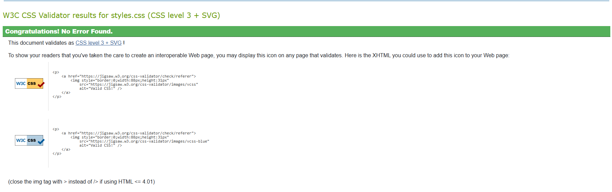
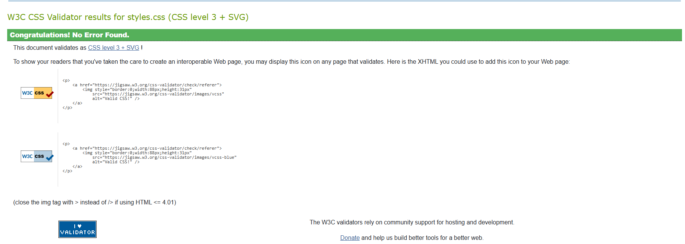
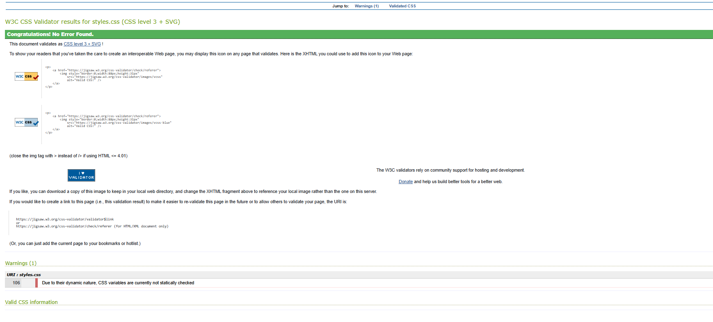
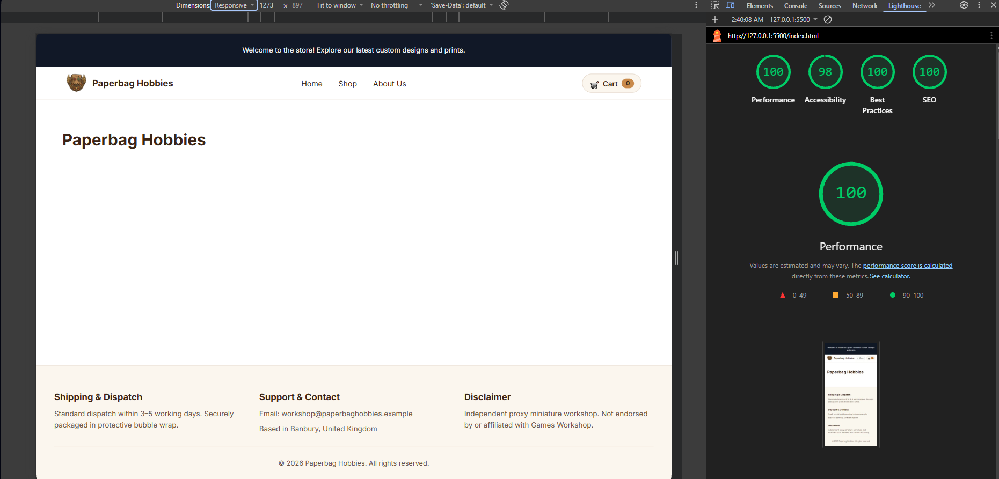
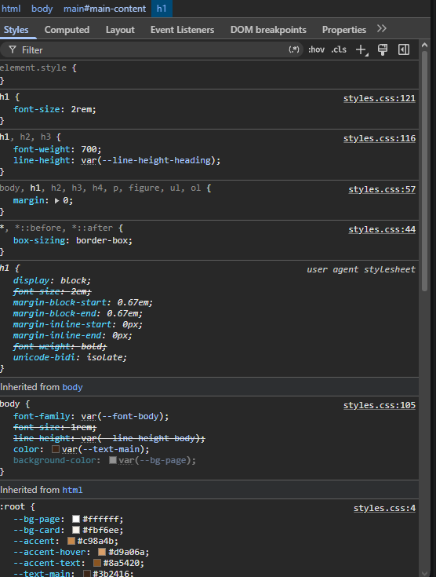
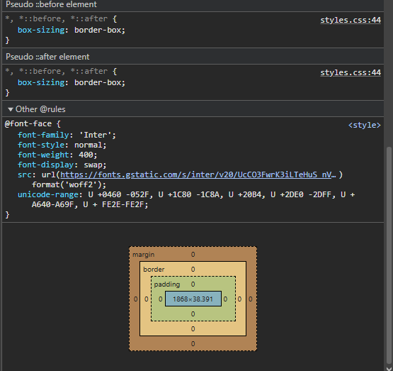
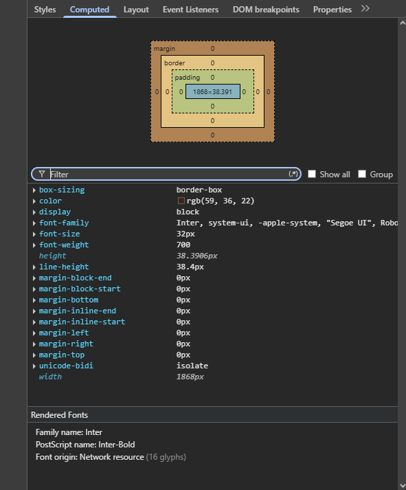
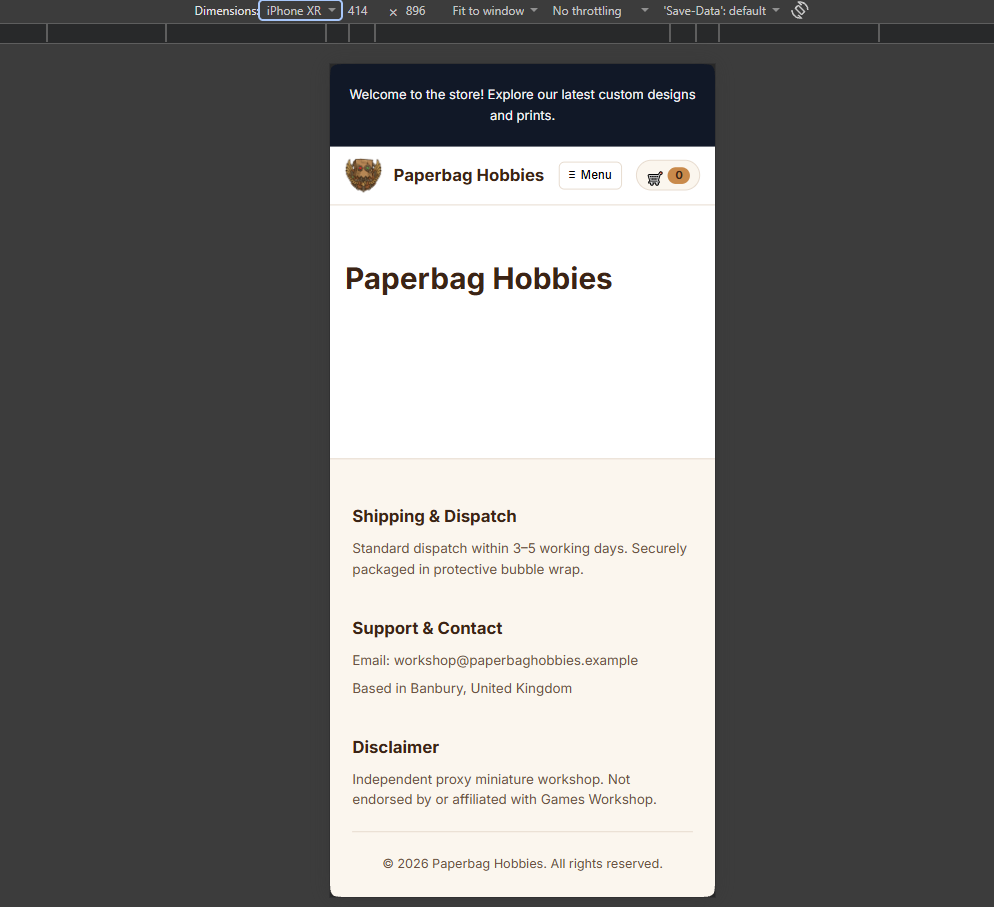
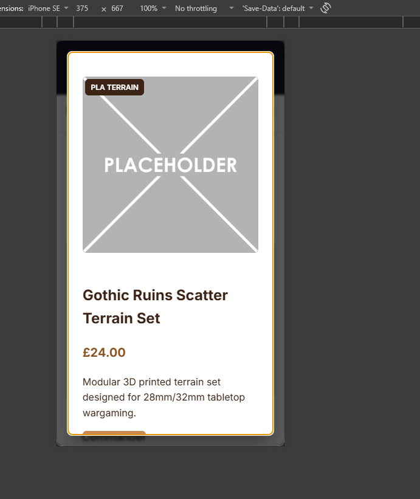
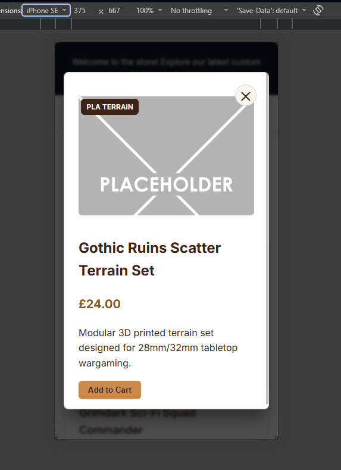

# Testing - Paperbag Hobbies

Back to [README](README.md).

## 1. Code validation

### 1.1 W3C HTML validator

| Date | File | Result | Notes |
|---|---|---|---|
| 05/10/2026 | `index.html` | Pass | No errors or warnings. Checked after Step 1.1 (HTML boilerplate). |

### 1.2 W3C CSS validator (Jigsaw)

| Date | File | Stage | Result | Notes |
|---|---|---|---|---|
| 05/10/2026 | `assets/css/styles.css` | Step 1.2 Part A: design tokens | Pass | No errors or warnings. |
| 05/10/2026 | `assets/css/styles.css` | Step 1.2 Part B: CSS reset | Pass | No errors or warnings. |
| 05/10/2026 | `assets/css/styles.css` | Step 1.2 Part C: global typography | Pass | No errors or warnings. |

Part A: design tokens

Part B: CSS reset

**Part C: global typography**

### 1.3 Lighthouse Performance & Quality Audit

Google Lighthouse was run on `index.html` using Chrome DevTools to test performance, accessibility, best practices, and SEO.

| Date | Page | Performance | Accessibility | Best Practices | SEO | Notes |
|---|---|---|---|---|---|---|
| 08/10/2026 | `index.html` | 100 | 98 | 100 | 100 | Initial page layout and navigation structure audit. |

### 1.4 JavaScript linter

`TODO:` add results once the JavaScript is written.

## 2. Manual testing

`TODO:` add the planned test table (functionality, usability, responsiveness).

### 2.1 Colour contrast (WCAG 2.1 AA)

Contrast ratios were calculated for every text and background pairing using the WCAG relative luminance formula. Full results are in the README, section 4.3.

| Pairing | Ratio | Required | Result |
|---|---|---|---|
| White text on `#c98a4b` (original buttons) | 2.91:1 | 4.5:1 | Fail |
| `#c98a4b` text on `#ffffff` (original prices) | 2.91:1 | 4.5:1 | Fail |
| `#3b2416` on `#c98a4b` (revised buttons) | 4.98:1 | 4.5:1 | Pass |
| `#8a5420` on `#ffffff` (revised accent text) | 6.23:1 | 4.5:1 | Pass |

`TODO:` confirm these with the WebAIM Contrast Checker and add a screenshot.

### 2.2 Typography check (browser developer tools)

| Check | Expected | Result |
|---|---|---|
| Typography rules applied to `h1` | `font-size: 2rem`, `font-weight: 700`, `line-height: 1.2` come from `styles.css`, and browser defaults are overridden | Pass |
| Margins removed by reset | Computed margin of `0` on `h1` | Pass |
| Design tokens resolve | All `:root` custom properties listed with correct values | Pass |
| Google Font loaded | Inter `@font-face` served from `fonts.gstatic.com` | Pass |
| Heading renders in Inter | Computed tab, Rendered Fonts shows Inter | Pass. Family Inter, PostScript name Inter-Bold, origin Network resource. |

**Computed values for the `h1`:**

| Property | Computed value | Source |
|---|---|---|
| `font-size` | 32px | `2rem` |
| `font-weight` | 700 | Heading rule |
| `line-height` | 38.4px | 32px × 1.2 (`--line-height-heading`) |
| `color` | `rgb(59, 36, 22)` | `#3b2416` (`--text-main`) |
| Margins | `0px` | CSS reset |

### 2.3 Device & Responsive Testing

#### Mobile Viewport Audit (Pixel 10 / iPhone XR)
* **Date:** October 2026
* **Viewports Tested:** 
  * Google Pixel 10 (`412px × 924px`)
  * iPhone XR (`414px × 896px`)

##### Visual Evidence (Pre-Fix Issues):

| Google Pixel 10 | iPhone XR |
| :---: | :---: |
|  |  |

##### Issues Identified & Resolved:

1. **Hamburger Button Text Wrapping ("Men u")**
   * **Issue:** Narrow viewports caused flex container compression in `.header-container`, forcing the button text to wrap awkwardly across two lines ("Men" / "u").
   * **Fix:** Applied `white-space: nowrap`, `flex-shrink: 0`, and adjusted internal button padding (`0.4rem 0.6rem`) on `.nav-toggle` within `@media (max-width: 768px)` to enforce single-line label rendering.

2. **Footer Column Horizontal Compression**
   * **Issue:** Footer columns (`Shipping & Dispatch`, `Support & Contact`, `Disclaimer`) remained arranged in a horizontal row on mobile screens below `768px`,

   ### 2.4 Feature Testing: US04 - Product Lightbox Quick View Modal

* **Date:** 08/10/2026
* **User Story:** US04 - Enlarge images in a lightbox
* **Viewports Tested:** Desktop (`1200px+`), iPhone SE (`375px × 667px`)

#### Feature Test Results

| Test Case | Step / Action | Expected Result | Result | Notes |
|---|---|---|---|---|
| **Modal Launch** | Click product card body or image | Lightbox `<dialog>` opens with dark backdrop, rendering correct image, title, badge, price, and description | Pass | Handled dynamically via `main.js` event delegation |
| **Backdrop Close** | Click dark overlay outside dialog | Modal closes cleanly | Pass | Native `<dialog>` click boundary check |
| **Close Button** | Click top-right `✕` button | Modal closes cleanly | Pass | Button dismissed and cleared modal |
| **CTA Bypass** | Click "Add to Cart" directly on card | Cart action fires without opening lightbox | Pass | Event listener guards against modal invocation |
| **Keyboard Lock** | Press `Tab` inside open modal | Focus traps inside `<dialog>` between close `✕` and CTA button | Pass | Native dialog focus trapping |
| **Escape Key** | Press `Escape` while modal is open | Modal closes immediately | Pass | Handled natively by `<dialog>` element |
| **Focus Restore** | Close modal via button or `Escape` | Focus returns directly to triggering card element | Pass | Preserves keyboard navigation context (US07) |
| **Mobile Reflow** | Open modal on 375px viewport | Content fits on screen with internal scroll and clear close control | Pass | Fixed height overflow bug (see below) |

#### Visual Evidence & Responsive Fix

##### Issue Identified (Pre-Fix):
On smaller mobile viewports (e.g., iPhone SE at `375px × 667px`), the modal exceeded screen height, clipping the primary action button off-screen and hiding the close control.

| Bug Identified (Pre-Fix) | Fixed Implementation |
| :---: | :---: |
|  |  |

##### Issues Identified & Resolved:

1. **Lightbox Vertical Content Clipping (iPhone SE)**
   * **Issue:** Capped pixel dimensions caused the modal content to spill below the bottom viewport fold, obscuring the primary CTA button and preventing access to controls without scrolling the entire page backdrop.
   * **Fix:** Updated `styles.css` under `.lightbox-dialog` to enforce `max-height: 85vh` and `overflow-y: auto`. Restricted mobile image containers (`.lightbox-image-container`) to `max-height: 200px` to maintain a compact vertical footprint while allowing inner dialog scrolling.

2. **Hidden Close Button Position**
   * **Issue:** Standard absolute positioning placed the close icon behind card edges on small screens.
   * **Fix:** Styled `.lightbox-close` as a high-contrast circular button with `position: absolute`, pinned to the top-right corner with a high `z-index: 10` for effortless touch dismissal.