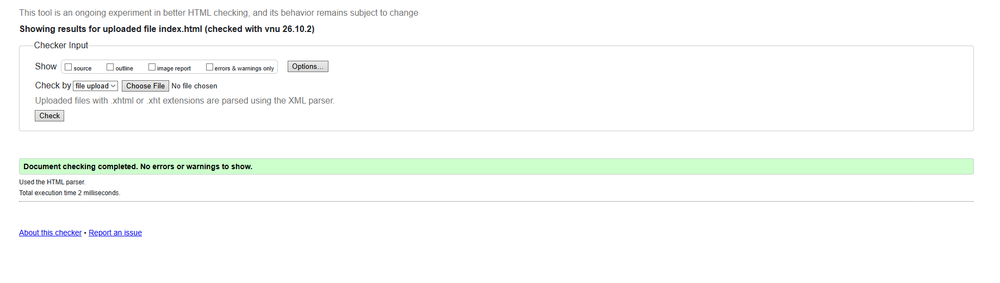

# Testing - Paperbag Hobbies

Back to [README](README.md).

## 1. Code validation

### 1.1 W3C HTML validator

| Date | File | Result | Notes |
|---|---|---|---|
| 05/10/2026 | `index.html` | Pass | No errors or warnings. Checked after Step 1.1 (HTML boilerplate). |

### 1.2 W3C CSS validator (Jigsaw)

`TODO:` add results as the CSS is built.

### 1.3 JavaScript linter

`TODO:` add results once the JavaScript is written.

## 2. Manual testing

`TODO:` add the planned test table (functionality, usability, responsiveness).

## 3. Browser and device matrix

`TODO`

## 4. Bug log

| # | Bug found | Cause | Fix | Status |
|---|---|---|---|---|
| B1 | Original palette failed WCAG AA contrast (white text on `#c98a4b`, about 2.9:1) | Accent colour too light for white text | Use dark text on accent backgrounds and a darker `--accent-text` token for coloured text | `TODO: confirm after contrast test` |

### Bugs left unfixed

`TODO`